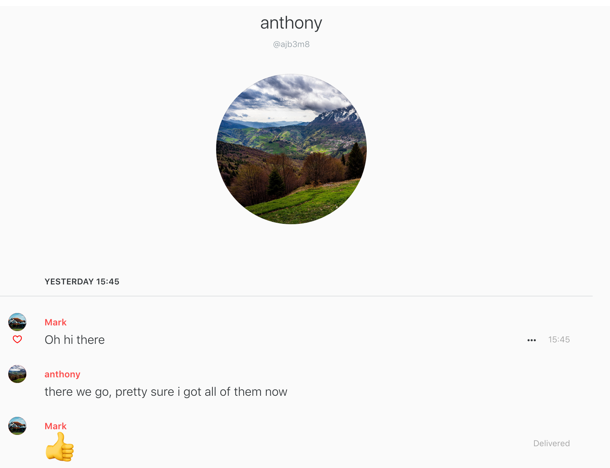
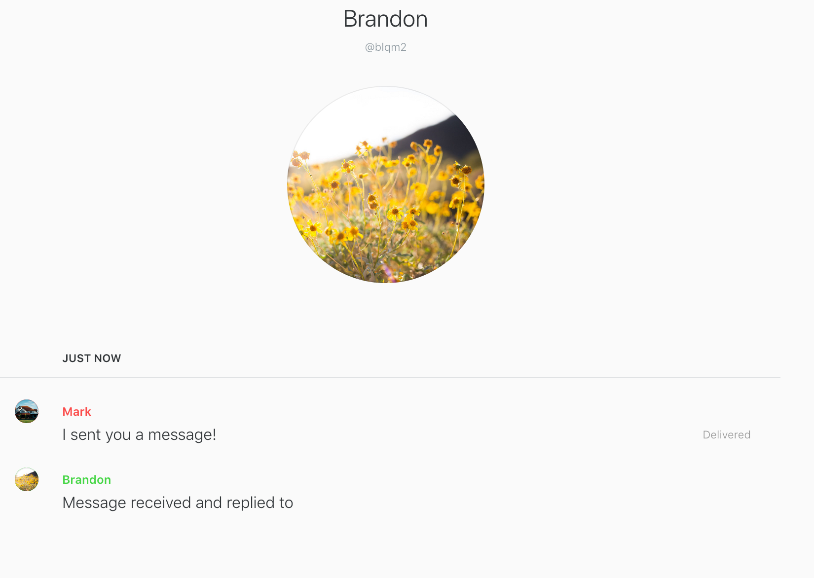

1. Create ssh key and set it up to log into gitlab/git-classes, take screenshots of it functioning

2. Fully validate the Kali iso your downloaded for pa00, from within Kali.

3.5.Encrypt separate back-and-forth discussions with 5 different students in 3600;
take a single screenshot for each back-and-forth exchange.
     
      
     
     
     
     
    
3.6 Get those same 5 students to sign your gpg2 public key at the command line in Kali;
include your signed key in your repo, and optionally (above) on the mailvelope keyserver.

4.With 5 students in the class (can be different or the same as for previous part), exchange back-and-forth communications in an open-source end-to-end PFS app of your choosing.
     * 
     * 
     * 
     * 
     * 
    